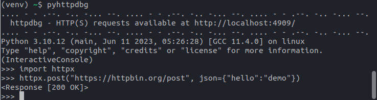
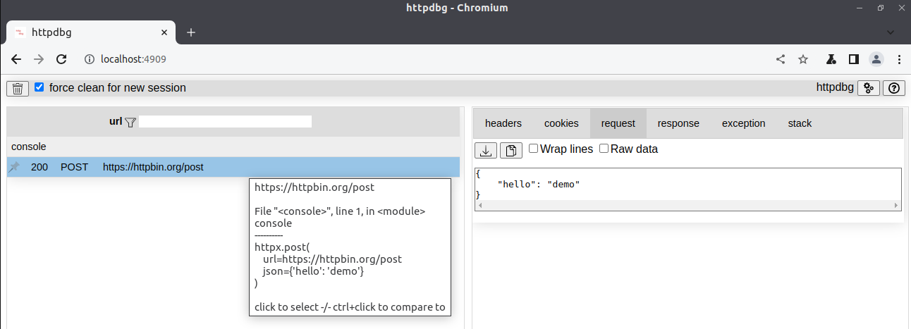

# getting started

## installation

_httpdbg_ is available on _pip_.

```console
(venv) ~/$ pip install httpdbg
```

### compatibility

_httpdbg_ has been tested on:

 * Python `3.6`, `3.7`, `3.8`, `3.9`, `3.10`, `3.11`, `3.12`.
 * `Linux`, `Windows`, `MacOS`.

## usage

To use _httpdbg_, the only thing you have to do is to replace the command `python` by `pyhttpdbg`. There is no modification to do in the code itself.

You can use _httpdbg_ to trace all the HTTP requests you do in a python console:

 * Open a Python console using the command `pyhttpdbg`

```console
(venv) ~/$ pyhttpdbg
```

 * Use a http client to perform a HTTP request

```python
import httpx
httpx.post("https://httpbin.org/post", json={"hello":"demo"})
```



  * Open a web browser and navigate to `http://localhost:4909` to show the HTTP request information.



