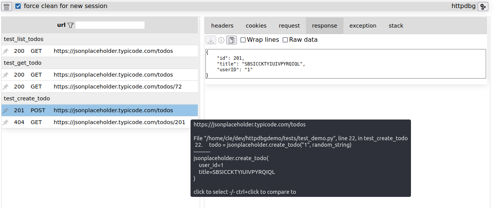

# httpdbg

Welcome to the _httpdbg_'s documentation!

_httpdbg_ is a tool to trace the HTTP(S) client requests in your python code.

## Simple

Simplicity is the keyword of _httpdbg_. It requires:

 * no external dependency
 * no setup
 * no super user right
 * no code modification

## Powerful

Simple doesn't mean basic:

  * the HTTP request initiator is reported for each request

## Integrated

Theorically, all pure python HTTP client libraries are fully traceable by _httpdbg_. 

Some of them have a special integration for more information:

 * [requests](https://pypi.org/project/requests/)
 * [httpx](https://pypi.org/project/httpx/)
 * [aiohttp](https://pypi.org/project/aiohttp/)
 * [urllib3](https://pypi.org/project/urllib3/)

Some extensions are available for different famous Python tools:

  * [pytest](https://pypi.org/project/pytest/)
  * [notebook](https://pypi.org/project/notebook/)
