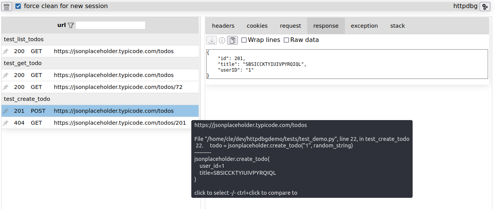

# Welcome to the httpdbg's documentation!

_httpdbg_ is a tool for tracing HTTP requests in your Python code for debugging purposes.



## httpdbg is easy to use

Simplicity is the keyword of _httpdbg_. It requires:

 * no external dependency
 * no setup
 * no super user right
 * no code modification

All what you have to do is to install `httpdbg` in your virtual environment:

```console
pip install httpdbg
```

Then, replace the `python` command with `pyhttpdbg` to execute your code.

The screenshot above was obtained simply by running some tests like this:

```console
pyhttpdbg -m pytest -v examples/
```

## httpdbg is not ...

_httpdbg_ isn’t just another proxy. It can:

  * Trace HTTP requests made by your client.
  * Trace HTTP requests received by your server.
  * Trace HTTP requests inside your Jupyter notebook.
  * Link HTTP requests directly to the relevant Python code.
  * Group HTTP requests by client call, endpoint, method, test function, and more.

_httpdbg_ is not a monitoring tool. It should not be used in production code, but only for debugging purposes.

## httpdbg supports the major HTTP packages

Theorically, all pure python HTTP requests are fully traceable by _httpdbg_. 

These HTTP clients have special integrations that provide even more detailed information:

 * [requests](https://pypi.org/project/requests/)
 * [httpx](https://pypi.org/project/httpx/)
 * [aiohttp](https://pypi.org/project/aiohttp/)
 * [urllib3](https://pypi.org/project/urllib3/)

These HTTP servers also have special integrations for enhanced insights:
 
 * [fastapi](https://pypi.org/project/fastapi/)
 * [flask](https://pypi.org/project/flask/)

Some test frameworks are also supported to provide additional information:

 * [pytest](https://pypi.org/project/pytest/)
 * [unittest](https://docs.python.org/3/library/unittest.html)

Some extensions are available for different famous Python tools:

  * [pytest-httpdbg](https://github.com/cle-b/pytest-httpdbg) for [pytest](https://pypi.org/project/pytest/)
  * [notebook-httpdbg](https://github.com/cle-b/notebook-httpdbg) for [notebook](https://pypi.org/project/notebook/)
