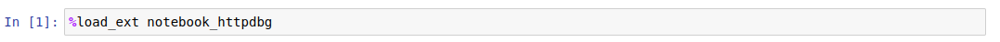

# httpdbg - notebook

You can use `httpdbg` to trace the HTTP requests in your notebook.

## installation

_notebook-httpdbg_ is available on _pip_.

```console
pip install notebook-httpdbg
```

## usage

To trace the HTTP requests in your notebook, load the `notebook-httpdbg` extension.

```python
%load_ext notebook_httpdbg
```



To trace the HTTP requests in a cell, just add the line `%%httpdbg`

```python
%%httpdbg
_ = requests.get("https://www.example.com")
```


### configuration

You can choose the number of character to print for each request.

```python
%%httpdbg --header 500 --body 10000
```
