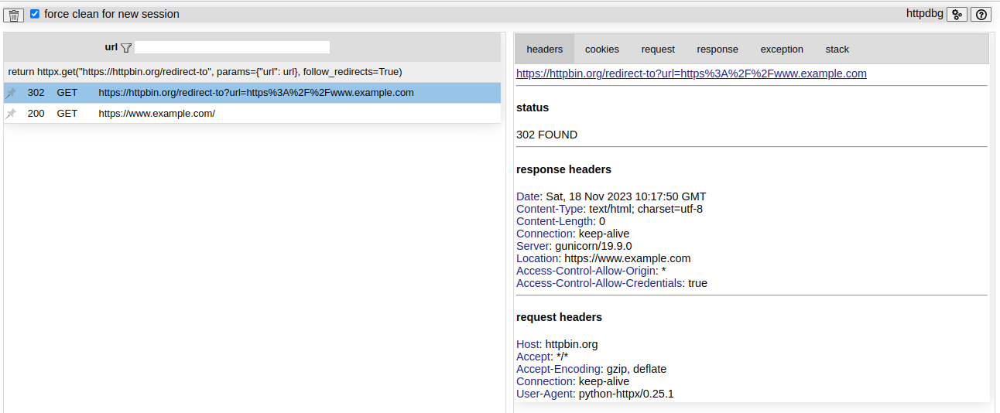
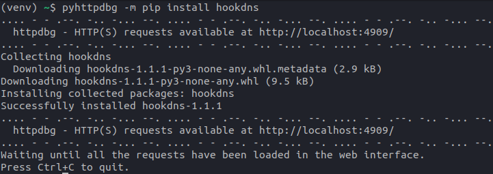
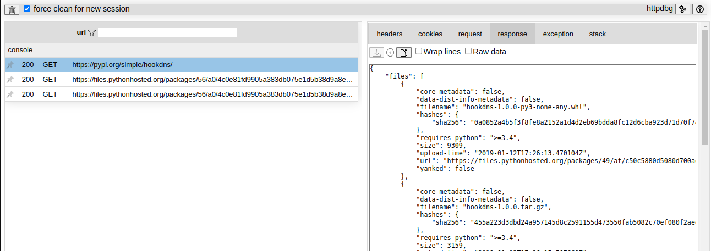
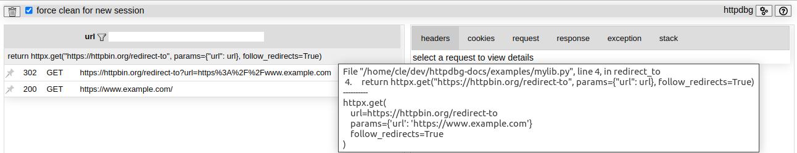
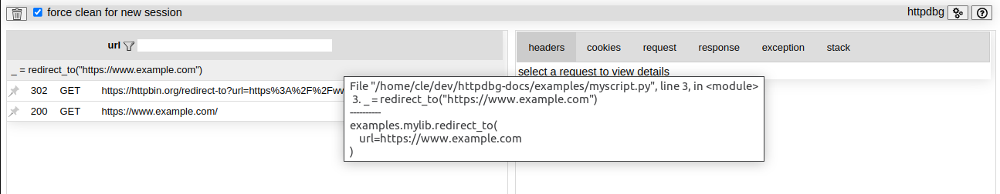

# pyhttpdbg

_pyhttpdbg_ is the command to use to trace the HTTP requests using _httpdbg_.

## usage

To trace the HTTP requests in your Python code, execute it by using the command `pyhttpdbg` instead `python`.

```console
(venv) ~/$ pyhttpdbg -h
usage: pyhttpdbg [-h] [--port PORT] [--version] [--initiator INITIATOR] [--keep-up | --force-quit]
                 [--console | --module MODULE | --script SCRIPT]

httdbg - a very simple tool to debug HTTP(S) client requests

options:
  -h, --help            show this help message and exit
  --port PORT, -p PORT  the web interface port
  --version, -v         print the httpdbg version
  --initiator INITIATOR, -i INITIATOR
                        add a new initiator (package)
  --keep-up, -k         keep the server up even if the requests have been read
  --force-quit, -q      stop the server even if the requests have not been read
  --console             run a python console (default)
  --module MODULE, -m MODULE
                        run library module as a script (the next args are passed to pytest as is)
  --script SCRIPT       run a script (the next args are passed to the script as is)

```

## console

You can use _httpdbg_ to trace all the HTTP requests you do in a python console.

Open a Python console using the command `pyhttpdbg`

```console
(venv) ~/$ pyhttpdbg
```

Use a http client to perform a HTTP request

```python
import httpx
httpx.post("https://httpbin.org/post", json={"hello":"demo"})
```


Open `http://localhost:4909`


## script

You can use _httpdbg_ to trace all the HTTP requests done when executing a script.

For this example, we will use these two files (get it [here](https://github.com/cle-b/httpdbg-docs/tree/main/example))

   * `examples/mylib.py`

```python
import httpx

def redirect_to(url):
    return httpx.get(
        "https://httpbin.org/redirect-to", params={"url": url}, follow_redirects=True
    )
```

   * `examples/myscript.py`

```python
from examples.mylib import redirect_to

_ = redirect_to("https://www.example.com")
```

Execute the script using `pyhttpdbg`

```console
(venv) ~/$ pyhttpdbg --script examples/myscript.py
```

Open a web browser and navigate to `http://localhost:4909` to list all the HTTP requests.



## module

_httpdbg_ can also be used to trace the HTTP requests done by a module.

For this example, we will trace the requests done by the `pip` module when we install a package.

Execute the module `pip` using `pyhttpdbg`

```console
(venv) ~/$ pyhttpdbg -m pip install hookdns
```



Open a web browser and navigate to `http://localhost:4909` to list all the HTTP requests.



## initiator

By default, we consider the HTTP libraries as the initiators of the requests. This is not always relevant and sometimes we may prefer to link the HTTP requests to the call of a function from another library. 

You can specify any libraries you want as initiator.

To illustrate what specifying an initiator means, we will reuse the same example as for the script execution. 

   * `examples/mylib.py`

```python
import httpx

def redirect_to(url):
    return httpx.get(
        "https://httpbin.org/redirect-to", params={"url": url}, follow_redirects=True
    )
```

   * `examples/myscript.py`

```python
from examples.mylib import redirect_to

_ = redirect_to("https://www.example.com")
```

Execute the script using `pyhttpdbg` without any custom initiator

```console
(venv) ~/$ pyhttpdbg --script examples/myscript.py
```

The initiator is a call to a httpx method



Execute the script using `pyhttpdbg` by adding the import `examples.mylib` as a custom initiator.

```console
(venv) ~/$ pyhttpdbg -i example.mylib --script examples/myscript.py
```

The initiator is the call to the function from the module `examples.mylib`


