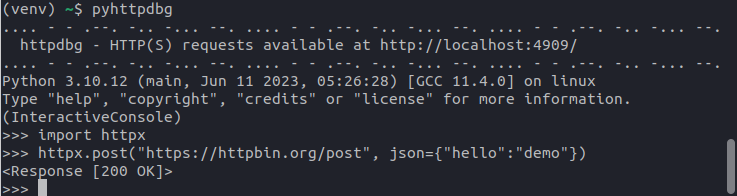

# pyhttpdbg

_pyhttpdbg_ is the command to use to trace the HTTP requests using _httpdbg_.

## usage

To trace the HTTP requests in your Python code, execute it by using the command `pyhttpdbg` instead of `python`.

```console
(venv) ~/$ pyhttpdbg --help
usage: pyhttpdbg [-h] [--host HOST] [--port PORT] [--version]
                 [--initiator INITIATOR] [--only-client]
                 [--keep-up | --force-quit]
                 [--console | --module MODULE | --script SCRIPT]

httpdbg - easily debug HTTP client and server requests

options:
  -h, --help            show this help message and exit
  --host HOST           the web interface host IP address
  --port PORT, -p PORT  the web interface port
  --version, -v         print the httpdbg version
  --initiator INITIATOR, -i INITIATOR
                        add a new initiator (package)
  --only-client         record only HTTP client requests
  --keep-up, -k         keep the server up even if the requests have been read
  --force-quit, -q      stop the server even if the requests have not been read
  --console             run a python console (default)
  --module MODULE, -m MODULE
                        run library module as a script (the next args are passed to pytest as is)
  --script SCRIPT       run a script (the next args are passed to the script as is)
```

## console

You can use _httpdbg_ to trace all the HTTP requests you do in a python console.

Open a Python console using the command `pyhttpdbg`

```console
(venv) ~/$ pyhttpdbg
```

Use a http client to perform a HTTP request

```python
import httpx
httpx.post("https://httpbin.org/post", json={"hello":"demo"})
```



Open `http://localhost:4909`


## script

You can use _httpdbg_ to trace all the HTTP requests done when executing a script.

For this example, we will use these two files (get it [here](https://github.com/cle-b/httpdbg-docs/tree/main/examples))

   * `examples/mylib.py`

```python
import httpx

def redirect_to(url):
    return httpx.get(
        "https://httpbin.org/redirect-to", params={"url": url}, follow_redirects=True
    )
```

   * `examples/myscript.py`

```python
from examples.mylib import redirect_to

_ = redirect_to("https://www.example.com")
```

Execute the script using `pyhttpdbg`

```console
(venv) ~/$ pyhttpdbg --script examples/myscript.py
```

Open a web browser and navigate to `http://localhost:4909` to list all the HTTP requests.


## module

_httpdbg_ can also be used to trace the HTTP requests done by a module.

For this example, we will trace the requests done by the `pip` module when we install a package.

Execute the module `pip` using `pyhttpdbg`

```console
(venv) ~/$ pyhttpdbg -m pip install hookdns
```


Open a web browser and navigate to `http://localhost:4909` to list all the HTTP requests.


## initiator

By default, we consider the HTTP libraries as the initiators of the requests. This is not always relevant and sometimes we may prefer to link the HTTP requests to the call of a function from another library. 

You can specify any libraries you want as initiator.

To illustrate what specifying an initiator means, we will reuse the same example as for the script execution. 

   * `examples/mylib.py`

```python
import httpx

def redirect_to(url):
    return httpx.get(
        "https://httpbin.org/redirect-to", params={"url": url}, follow_redirects=True
    )
```

   * `examples/myscript.py`

```python
from examples.mylib import redirect_to

_ = redirect_to("https://www.example.com")
```

Execute the script using `pyhttpdbg` without any custom initiator

```console
(venv) ~/$ pyhttpdbg --script examples/myscript.py
```

The initiator is a call to a httpx method.


Execute the script using `pyhttpdbg` and add the module `examples.mylib` as a custom initiator.

```console
(venv) ~/$ pyhttpdbg -i examples.mylib --script examples/myscript.py
```

The initiator is the call to the function from the module `examples.mylib`.


## endpoint

You can use _httpdbg_ to debug your HTTP server. In this case, the HTTP requests will be grouped by endpoint. Server-side requests can be easily identified by the server tag.

Here’s an example of using _httpdbg_ with FastAPI:

```python 
from typing import Union

from fastapi import FastAPI
from fastapi import HTTPException
from pydantic import BaseModel
import requests

app = FastAPI()


class Port(BaseModel):
    port: int


@app.get("/")
def hello_world():
    return "Hello, World!"


@app.get("/items/{item_id}")
def get_item(item_id: int, q: Union[str, None] = None):
    if item_id == 456:
        raise HTTPException(
            status_code=456,
            detail="custom exception",
            headers={"X-Error": "This is an HTTP 456 error"},
        )
    return {"item_id": item_id, "q": q}


@app.post("/withclientrequest")
def do_client_request(port: Port):
    requests.get(f"http://localhost:{port.port}/")
    return "ok"

``` 

Replace `python` by `pyhttpdbg` to start the server:

```console
$ pyhttpdbg -m fastapi run tests/demo_fastapi.py 
.... - - .--. -.. -... --. .... - - .--. -.. -... --. .... - - .--. -.. -... --.
  httpdbg - HTTP(S) requests available at http://localhost:4909/
.... - - .--. -.. -... --. .... - - .--. -.. -... --. .... - - .--. -.. -... --.

   FastAPI   Starting production server 🚀
 
             Searching for package file structure from directories with         
             __init__.py files                                                  
             Importing from /home/cle/dev/httpdbg
 
    module   📁 tests              
             ├── 🐍 __init__.py    
             └── 🐍 demo_fastapi.py
 
      code   Importing the FastAPI app object from the module with the following
             code:                                                              
 
             from tests.demo_fastapi import app
 
       app   Using import string: tests.demo_fastapi:app
 
    server   Server started at http://0.0.0.0:8000
    server   Documentation at http://0.0.0.0:8000/docs
 
             Logs:
 
      INFO   Started server process [14228]
      INFO   Waiting for application startup.
      INFO   Application startup complete.
      INFO   Uvicorn running on http://0.0.0.0:8000 (Press CTRL+C to quit)
      INFO   127.0.0.1:36978 - "GET / HTTP/1.1" 200
      INFO   127.0.0.1:36982 - "GET /items/123 HTTP/1.1" 200
      INFO   127.0.0.1:43596 - "GET /items/456 HTTP/1.1" 456
      INFO   127.0.0.1:36026 - "POST /withclientrequest HTTP/1.1" 200
```

