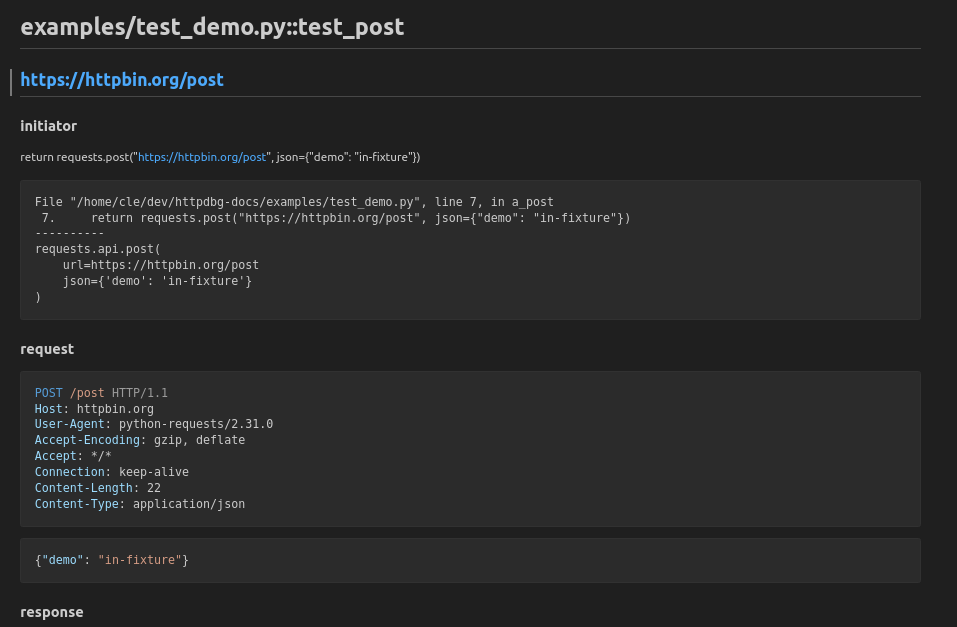

# test frameworks

You can use `httpdbg` to trace the HTTP requests in your tests using `pyhttpdbg`

## pytest

Here is an example of test file:

```python
import pytest
import requests


@pytest.fixture(scope="session", autouse=True)
def get_in_a_fixture():
    requests.get("https://httpbin.org/get/session/setup")
    yield
    requests.get("https://httpbin.org/get/session/teardown")


@pytest.fixture()
def post_in_a_fixture():
    return requests.post("https://httpbin.org/post", json={"demo": "in-fixture"})


def test_post(post_in_a_fixture):
    assert post_in_a_fixture.status_code == 200
    assert (
        requests.post("https://httpbin.org/post", json={"demo": "in-test"}).status_code
        == 200
    )


def test_get():
    assert requests.get("https://www.example.com").status_code == 200
```

You can use `pyhttpdbg` to execute `pytest` like for any module.

```console
pyhttpdbg -m pytest -v examples/
```


Open `http://localhost:4909`


In that case, the requests are grouped by test, but you can switch to grouping them by initiator by changing the view mode in the UI.

When an HTTP request is sent from a fixture, the name of the fixture is displayed in the UI. If you prefer not to see this information, you can choose to hide the tags in the UI settings. See [User interface > Configuration](ui.md) for more details.

### pytest-httpdbg

You can use the pytest plugin `pytest-httpdbg` to save the trace of the HTTP requests in your test report.

#### installation

_pytest-httpdbg_ is available on _pip_.

```console
pip install pytest-httpdbg
```

#### usage

```console
  --httpdbg             record HTTP(S) requests
  --httpdbg-dir=HTTPDBG_DIR
                        save httpdbg traces in a directory
  --httpdbg-no-clean    do not clean the httpdbg directory
  --httpdbg-initiator=HTTPDBG_INITIATOR
                        add a new initiator (package) for httpdbg
```

#### generate report

For this example, we will use [`pytest-html`](https://pypi.org/project/pytest-html/) to generate the report.


You can copy the following code in your top-level `conftest.py` to include the logs into your report.

```python
import os

import pytest

from pytest_httpdbg import httpdbg_record_filename


@pytest.hookimpl(hookwrapper=True)
def pytest_runtest_makereport(item, call):
    pytest_html = item.config.pluginmanager.getplugin("html")
    outcome = yield
    report = outcome.get_result()
    extras = getattr(report, "extras", [])

    if call.when == "call":
        if httpdbg_record_filename in item.stash:
            extras.append(
                pytest_html.extras.url(
                    os.path.basename(item.stash[httpdbg_record_filename]),
                    name="HTTPDBG",
                )
            )
            report.extras = extras
```

_This example works if you use the same directory for the html test report files and the httpdbg logs. If this is not the case, you must adapt it to your configuration._

Run the tests using the `pytest` command.

```console
pytest examples/ --httpdbg --httpdbg-dir report  --html=report/report.html
```


Open the test report in a browser.


There is a link to an HTTPDBG trace export for each test. Open it using a markdown viewer.



## unittest

If you run your _unittest_ tests using _pyhttpdbg_, the HTTP requests will be grouped by test/setup/teardown methods.

```console
pyhttpdbg -m unittest tests/demo_run_unittest.py
```


