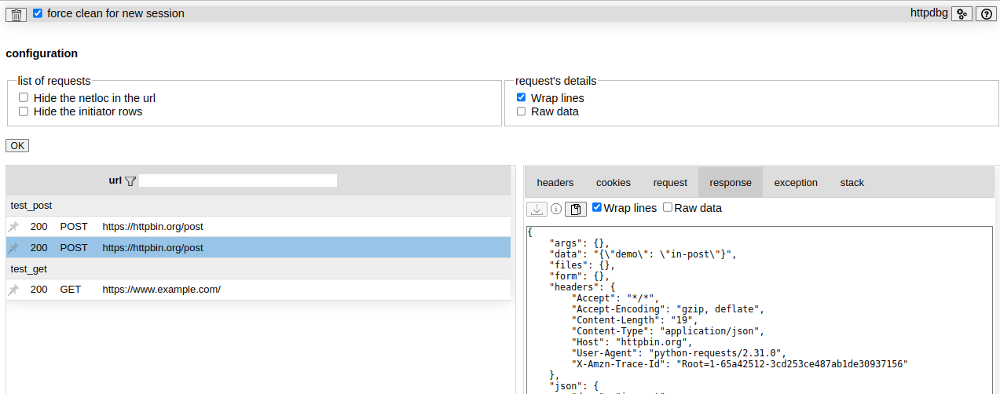
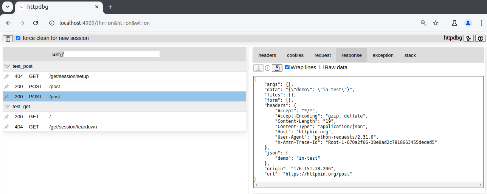

# User interface

Navigate to [http://localhost:4909/](http://localhost:4909/) to open the user interface.

## Availability

By default, `pyhttpdbg` ends when your program has ended and all the request informations have been loaded in the web page. After that, you can continue to browse the list of requests, but you can't download to content of each individual requests using the download button in the _request_ and _response_ tabs. If you want to be able to download the content of the requests after your program has ended, you can use the `-k` option to keep `pyhttpdbg` up even after your program has ended. 

## Custom host

By default, the web server listens on the `localhost` address only, but this can be modified using the `--host` command line option.

## Custom port

By default, we use the port `4909` but this is configurable using the command line option `-p` (`--port`).

## Configuration

To configure the user interface, click on the `open configuration` button on the top right corner. 

After you click on the `ok` button, the url is updated to include the configuration. Bookmark it to keep this configuration each time you will use `pyhttpdbg`.

